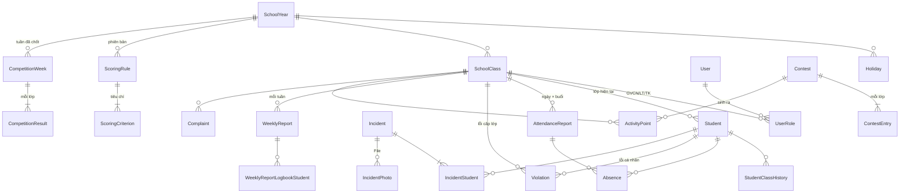

# Thiết kế cơ sở dữ liệu – PostgreSQL

Chỉ dùng **PostgreSQL** (Sequelize), không dùng MongoDB.
DDL đầy đủ: [schema.sql](schema.sql). File này đã chạy thử trên PostgreSQL 16.

## Quy ước (theo base backend)

- Tên bảng PascalCase (`"Student"`), tên cột camelCase (`"classId"`). Trong SQL thuần phải đặt cả hai trong dấu ngoặc kép.
- Khóa chính `"_id" VARCHAR(24)` dạng ObjectId, sinh ở tầng ứng dụng (`@StrObjectId()`). Giữ kiểu này để dùng lại được `BaseControllerFactory` và `SqlRepository`.
- `"createdAt"`, `"updatedAt"` kiểu `TIMESTAMPTZ`; ngày học kiểu `DATE`; giờ chốt kiểu `TIME`.
- Enum lưu bằng `VARCHAR` + `CHECK`, không dùng kiểu `ENUM` của PG, để thêm giá trị mới chỉ cần sửa CHECK trong migration.
- Mọi khóa ngoại có `REFERENCES`. Học sinh và lớp **không bao giờ bị xóa**, chỉ đổi trạng thái, nên phần lớn khóa ngoại để mặc định `RESTRICT`.

## Sơ đồ quan hệ

## Danh sách bảng

| Nhóm | Bảng | Nội dung | Người ghi |
| --- | --- | --- | --- |
| Tài khoản | `User` *(có sẵn, mở rộng)* | Tài khoản; thêm `phone`, `mustChangePassword`, `locked`; `email` không bắt buộc | Cấp quản lý |
| | `UserRole` | Vai trò nghiệp vụ; một người nhiều vai trò | Cấp quản lý |
| Năm học | `SchoolYear`, `Holiday` | Lịch tuần, học kỳ, ngày lễ | Cấp quản lý |
| | `SchoolClass` | Lớp **theo năm học**, GVCN | Cấp quản lý |
| | `Student`, `StudentClassHistory` | Danh sách nguồn, lịch sử chuyển lớp | Cấp quản lý |
| Sĩ số | `AttendanceReport`, `Absence` | Báo cáo mỗi buổi + từng học sinh vắng | Lớp trưởng / GVCN |
| Nền nếp | `Violation` | Lỗi cá nhân và lỗi cấp lớp (vệ sinh, HĐTN) | Giám thị; lớp trưởng (trốn tiết) |
| Sự việc | `Incident`, `IncidentStudent`, `IncidentPhoto` | Sự việc, học sinh liên quan, ảnh | Mọi vai trò; QL xử lý |
| Thư ký | `WeeklyReport`, `WeeklyReportLogbookStudent` | ĐTB SĐB, KT miệng, ghi SĐB | Thư ký / GVCN |
| Đoàn | `Contest`, `ContestEntry` | Cuộc thi, lớp tham gia, giải | Cấp quản lý |
| | `ActivityPoint` | Điểm cộng 3.x, 4.x; hạ bậc 4.5 | Cấp quản lý / hệ thống |
| | `Complaint` | Khiếu nại số liệu tuần | Thư ký → QL |
| Quy chế | `ScoringRule`, `ScoringCriterion` | Quy chế theo phiên bản + danh mục tiêu chí | Cấp quản lý |
| Kết quả | `CompetitionWeek`, `CompetitionResult` | Kết quả cố định khi chốt tuần | Hệ thống |
| Hệ thống | `AppConfig` | Giờ chốt, hạn nộp, số điện thoại khẩn, mốc nghỉ | Cấp quản lý |
| | `AuditLog` *(có sẵn, thêm cột)* | Nhật ký: thêm `resource`, `oldValue`, `newValue` | Hệ thống |
| | `File` *(có sẵn)* | Ảnh sự việc | |

## Ghi chú triển khai (module đã sinh trong backend)

Mỗi bảng là một module trong `backend/src/modules/<tên-kebab>/`, sinh bằng `aisoft base <tên> sql` và kế thừa `BaseControllerFactory`, `BaseService`, `SqlRepository`. Bảng do Sequelize tự tạo khi chạy ở môi trường dev (`synchronize`). Một số chỗ khác `schema.sql`:

- **Mọi bảng đều có `_id`**, kể cả bảng nối, vì base cần cột này. Khóa ghép trong `schema.sql` (ví dụ `IncidentStudent(incidentId, studentId)`) chuyển thành unique index.
- **Không có khóa ngoại tới `User` và `File`**, vì base vẫn lưu hai bảng đó ở MongoDB. Các cột `*ById`, `reporterId`, `userId`, `fileId` chỉ lưu id dạng chuỗi.
- **Không có các `CHECK` nhiều cột và cột sinh tự động `Absence.sessionCount`**, vì Sequelize sync không tạo được. Enum được kiểm tra ở `class-validator` (API) và `validate.isIn` (model). Các ràng buộc còn lại sẽ thêm bằng migration hoặc kiểm tra ở service.
- **Điểm số dùng `DOUBLE` thay vì `NUMERIC`**, để Sequelize trả về số chứ không phải chuỗi.

## Các quyết định thiết kế chính

**1. Mỗi tiêu chí chỉ có một nguồn.** Bảng tuần không lưu lại số liệu đã nhập; mọi điểm được tính từ các bảng nguồn:

| Tiêu chí | Lấy từ |
| --- | --- |
| Nghỉ học | `Absence` |
| Đi muộn, thẻ, đồng phục, giày dép, đầu tóc, trốn tiết, vệ sinh, HĐTN | `Violation` |
| Học tập, ghi SĐB | `WeeklyReport` |
| Điểm cộng, không tham gia cuộc thi | `ActivityPoint` |
| Hạ bậc do sự việc | `Incident` có `verifyResult = 'VI_PHAM'` |

**2. Không có bảng `Week`.** Tuần N là 7 ngày bắt đầu từ `week1StartDate + 7×(N−1)`. Tuần "đã chốt" khi có dòng trong `CompetitionWeek`. Như vậy không có hai nơi cùng lưu ngày bắt đầu/kết thúc tuần rồi lệch nhau.

**3. Lớp gắn năm học.** "10A1" năm 2026-2027 và "10A1" năm 2027-2028 là hai dòng khác nhau, nên lịch sử thi đua các năm không lẫn vào nhau. `Violation.classId` và `IncidentStudent.classId` lưu lớp **tại thời điểm xảy ra**. Học sinh chuyển lớp thì lỗi cũ vẫn tính cho lớp cũ.

**4. Ràng buộc nghiệp vụ đặt ngay trong DB** (đã chạy thử):

| Ràng buộc | Cách làm |
| --- | --- |
| Hai giám thị nhập trùng một lỗi | Unique `(studentId, type, date)`; lỗi cấp lớp unique `(classId, type, date)`. Dùng partial index. |
| Lỗi cấp lớp không gắn học sinh, lỗi cá nhân phải có học sinh | `CHECK` trên `Violation` |
| Mỗi lớp một báo cáo mỗi buổi | Unique `(classId, date, session)` |
| Số vắng không lệch sĩ số | `CHECK absentCount + presentCount = total`; server tính `absentCount` = số dòng `Absence` |
| Vắng "cả ngày" = 2 buổi | Cột sinh tự động `Absence.sessionCount`; đếm buổi nghỉ trong học kỳ bằng `SUM("sessionCount")` |
| GVCN/LT/TK phải có lớp; QL/giám thị không có lớp | `CHECK` trên `UserRole` |
| Một thư ký một báo cáo mỗi tuần | Unique `(schoolYearId, classId, weekNo)`; `logbookAvg NUMERIC(4,2)` trong 0–10 |
| Chỉ một năm học hiện tại | Partial unique index trên `isCurrent` |
| Sự việc đã qua bước xác minh phải có kết quả | `CHECK` trên `Incident` |
| Ngưỡng xếp loại hợp lệ | `CHECK xsMin ≥ tMin ≥ khMin` |

**5. Quy chế theo phiên bản.**
- `ScoringRule` có `effectiveFromWeek` và các ngưỡng xếp loại.
- `ScoringCriterion` là danh mục tiêu chí: mã, tên, nhóm, `kind` (`PLUS` / `MINUS` / `DOWNGRADE`), điểm.
- Mã tiêu chí khớp các khóa engine đang dùng: `DI_MUON`, `NGHI_CO_PHEP`, `NGHI_KHONG_PHEP` (10), `TRON_TIET`, `GHI_SDB`, `HDTN_QUA_7P`, `VE_SINH_BAN`, `ORAL_HIGH`, `ORAL_LOW`, `3.1`…`4.6`.
- Quy chế áp dụng cho tuần N là phiên bản có `effectiveFromWeek` lớn nhất mà ≤ N.
- Không cho tạo phiên bản có `effectiveFromWeek` ≤ tuần đã chốt gần nhất.

**6. Kết quả tuần chốt lưu cố định, mỗi lớp một dòng.**
- `CompetitionResult` có `total`, `rank`, `finalRank` ở dạng cột riêng, nên tổng hợp tháng, học kỳ và diễn biến làm thẳng bằng SQL (`SUM`, `AVG`, `COUNT FILTER`).
- Phần chi tiết theo từng lỗi (`counts`, `deductionPoints`, `downgrades`) để JSONB.
- `CompetitionWeek.scoringRuleId` ghi lại quy chế đã dùng.

**7. Hoạt động Đoàn.** Đoàn nhập kết quả vào `Contest` + `ContestEntry`. Khi công bố, server sinh `ActivityPoint` vào tuần trao giải: lớp có giải → 4.1–4.4; lớp `participated = false` → 4.5 (hạ bậc). `ActivityPoint` không lưu số điểm, điểm lấy theo quy chế của tuần.

**8. Tìm học sinh không dấu.** Server sinh `nameNoAccent` và `givenName` khi lưu. Index `varchar_pattern_ops` phục vụ tìm theo tiền tố (`LIKE 'ha%'`). Hiện tại FE tải danh sách lớp hoặc toàn trường (khoảng 1.500 em) rồi lọc tại máy, nên chưa cần full-text search.

## Backend phải kiểm tra thêm (DB không tự chặn được)

1. **Khóa tuần:** ghi/sửa/xóa `AttendanceReport`, `Absence`, `Violation`, `WeeklyReport` và `ActivityPoint` có ngày thuộc tuần đã có `CompetitionWeek` thì chỉ `QUAN_LY` được làm. Đổi `Incident.verifyResult` của tuần đã chốt cũng vậy.
2. **Phạm vi lớp:** LT/TK/GVCN chỉ đọc và ghi dữ liệu thuộc `classId` trong `UserRole` của mình. Giám thị không đọc `AttendanceReport` và `WeeklyReport`. Giám thị chỉ sửa `Violation` có `createdById` là mình.
3. **Sĩ số:** mọi `Absence.studentId` phải thuộc lớp của báo cáo và đang học. Học sinh đã khai "cả ngày" ở báo cáo sáng thì không được khai lại ở báo cáo chiều cùng ngày.
4. **Chốt tuần:** server **tự tính lại** kết quả, không nhận số do FE gửi. Tạo `CompetitionWeek` + `CompetitionResult` và đổi `WeeklyReport.status = 'DA_CHOT'` trong **một transaction**.
5. **Ghi nhật ký** ở tầng service (biết giá trị cũ và mới), không dựa vào interceptor.
6. **Job định kỳ:**
   - Nhắc sĩ số lúc `attendanceDeadline`.
   - Nhắc báo cáo tuần lúc hạn nộp.
   - Mỗi phút: sự việc khẩn quá `emergencyRemindMinutes` chưa có `receivedAt` thì nhắc lại và cập nhật `remindedAt`.

## Việc cần làm ở base backend để chuyển sang PostgreSQL

- `RepositoryModule`: bỏ `MongooseModel`, `MongooseSchemaProvider`; bật `SequelizeModule.forFeature(SequelizeModel)` và `SequelizeService`. Mỗi module dùng `*-sql.repository.ts`.
- Bỏ `DB_URI` / `MONGODB_URI` khỏi `.env`, `docker-compose.yml` và cấu hình.
- `SequelizeConfigService` đang để `synchronize: true, alter: true` ở môi trường dev. Nên tắt và tạo bảng bằng **migration** (`sequelize/migrations`) theo `schema.sql`, vì `alter` không tạo được partial index, cột sinh tự động và CHECK nhiều cột.
- Model Sequelize cho các bảng mới đặt trong `src/modules/repository/sequelize/model/`; thêm tên bảng vào `entity.ts`.

## Khối lượng ước tính (1 năm học)

38 lớp, khoảng 1.500 học sinh.

| Bảng | Số dòng / năm |
| --- | --- |
| `AttendanceReport` | ~8.400 |
| `Absence` | ~15–25 nghìn |
| `Violation` | vài chục nghìn |
| `CompetitionResult` | 38 × 37 ≈ 1.400 |

Cỡ dữ liệu này nhỏ, các index trong `schema.sql` là đủ, không cần partition.

## Thay đổi FE để khớp

- `SchoolClass`, `ScoringRule` thêm `schoolYearId`.
- `User.roles` lấy từ bảng `UserRole`; API `/user/me` trả kèm `roles`.
- `AttendanceReport.absences`: API trả kèm danh sách `Absence` (include), FE giữ nguyên dạng mảng.
- `Incident.students` / `photos` lấy từ `IncidentStudent` / `IncidentPhoto`; ảnh upload qua module `File`.
- `ScoringRule.deductions` / `bonuses` dựng lại từ `ScoringCriterion`.
- Thêm màn `Contest` cho Đoàn; `ActivityPoint` loại 4.1–4.5 do server sinh.
- `CompetitionWeek.results` = các dòng `CompetitionResult`.
